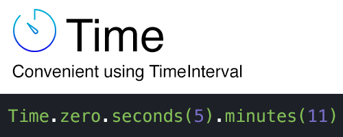

# Completions
Convinient using TimeInterval value.



### Examples
```swift
Time(0).seconds // == 0 seconds == 0 TimeInterval

Time.zero // == Time(0)

Time.zero.seconds(5).minutes(3).seconds // is equal to 185 seconds of TimeInterval
```

For example, we need to set duration of animation, we can do it easy
```swift
UIView.animate(withDuration: Time(1).minutes(1)) { // duration of animation has become 1 minute and 1 second
  // animation block
}
```
